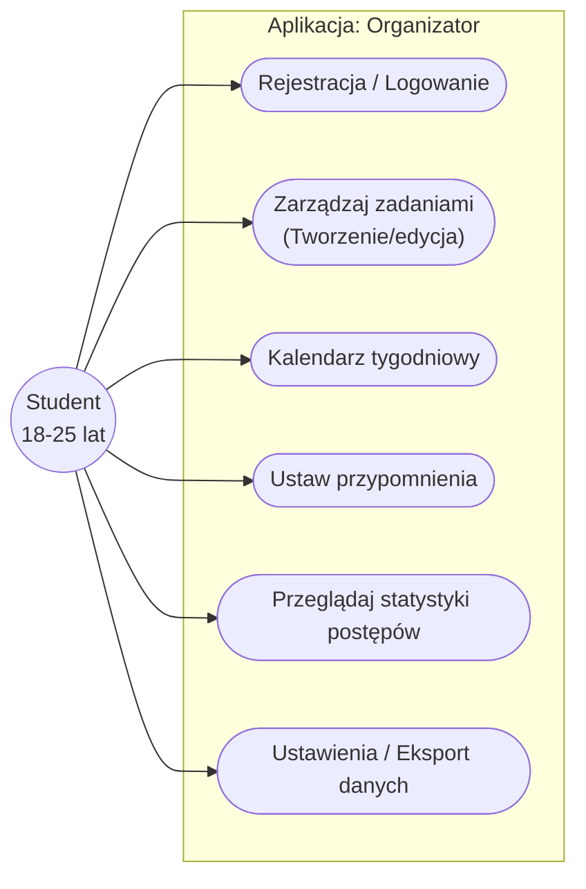

```mermaid
flowchart LR
    actorStudent((Student<br/>18-25 lat))

    subgraph app["Aplikacja: Organizator"]
        direction TB
        reg(["Rejestracja / Logowanie"])
        tasks(["Zarządzaj zadaniami<br/>(Tworzenie/edycja)"])
        calendar(["Kalendarz tygodniowy"])
        reminders(["Ustaw przypomnienia"])
        stats(["Przeglądaj statystyki postępów"])
        settings(["Ustawienia / Eksport danych"])
    end

    actorStudent --> reg
    actorStudent --> tasks
    actorStudent --> calendar
    actorStudent --> reminders
    actorStudent --> stats
    actorStudent --> settings
```
