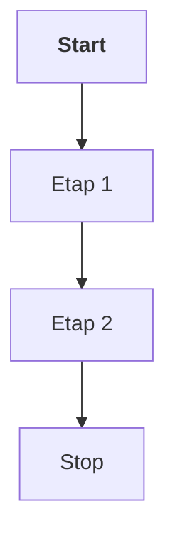

- [x] wykonany task
- [ ] niewykonany task

That is so funny! :joy:


---

---
| kolumna A | kolumna B | kolumna C |
| --- | --- | --- |
| linia 1 a | linia 1 b | linia 3 c |
| linia 2 a | linia 2 b | linia 2 c |

# Duży nagłówek
jakiś tekst pod duzym naglowkiem
## Średni
mozemy **pogrubiac i jak mamy wiecej wyrazow to tez** wazne kwestie, a inne pisac *kursywa*
### Mały nagłówek
- pierwszy element
- drugi element
  - podpunkt
  - kolejny podpunkt
- trzeci element

1. Pierwszy podpunkt
2. Drugi
3. i tak dalej
4. ostatni podpunkt

<pre>tutaj bylby kod zrodlowy</pre>

```
kod zrodlowy programu
druga linijka
for (x .....)
```

[link do gooogle.pl](https://google.pl)
